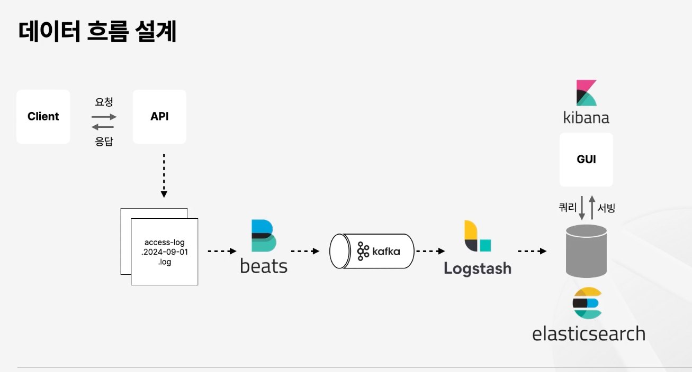

## 전자상거래 서비스

    
요구사항

    
## Description

전자상거래 MVP 서비스 구현. 

- 고객(Membership)
  - 회원가입
  - 로그인
  - 장바구니 결재 시, 로그인 확인
- 상품(Item)
  - 상품 목록 조회(무한스크롤)
    - 상품 조회는 ElasticSearch를 이용한 검색 성능 향상
    - 필터링(optional)
  - 카테고리에 따른 물품조회(하위 카테고리 클릭시 포함)
  - 단일 물품 정보
- 장바구니(Cart)
  - 품목별 수량 표시 및 비용 합산
- 결재(Payment)
  - 결재 프로세스
  - 결재완료 후 알림

추가 고려 - optional
- 배송상태(진행단계)
- 주문자 정보

## Requirements

- 구현할 API
  - 상품 조회 API
    - 목록 조회(Category 별 목록 조회, 무한스크롤 방식)
    - 단일 조회
  - 고객 API
    - 회원가입 API
    - 로그인 API
  - 장바구니 API
    - 물품 및 수량 API
  - 결재 API
    - 결재 API 
    - 결재완료 알림 API

    
패키지 구조

    
ERD

    
시퀀스 다이어그램

    
Swagger(API 문서)

    
검색기능 최적화

- DB를 이용한 검색 최적화
- ElasticSearch를 이용한 검색 최적화

검색 비교 시, 성능 테스트 고려? 아님 어디까지 검색이 가능한지에 대한 범위 검색? 정해서 진행해야 함

    
성능 최적화

- 성능 최적화
  - 인덱스를 이용한 성능 최적화
  - ElasticSearch를 이용한 성능 최적화

- 카테고리 성능 최적화
  - 디비 호출
  - 캐싱 기능
  - Redis 활용

- 동시성 분석
  - 어떤 주제의 동시성을 분석할 것인가

    
로그수집(ELK stack) - optional

