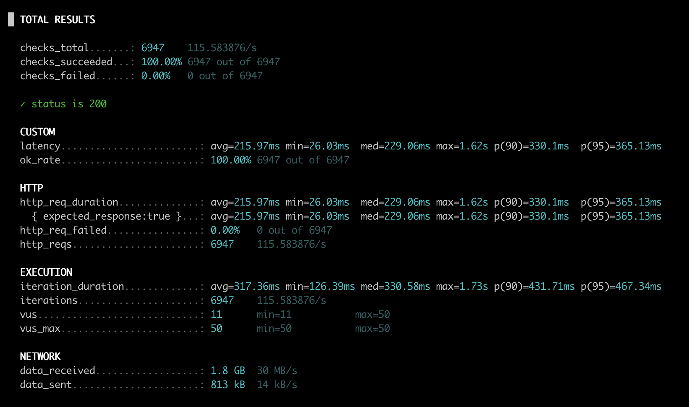

## 전자상거래 서비스

<details>
    <summary style="font-weight: bold; font-size: 17px;">요구사항</summary>

## Description

본 프로젝트는 전자상거래 도메인을 대상으로 한 **검색 기능 중심의 MVP**로, <br>
초기 단계에서는 전체 커머스 기능 구현보다 **검색 성능 최적화 및 아키텍처 검증**에 초점을 두었다.

특히 SQL 기반 검색의 한계를 분석하고,  <br>
Elasticsearch(Nori Analyzer 적용)를 활용한 검색 구조로 전환하여 <br>
검색 성능 및 확장성을 개선하는 과정을 구현 및 부하 테스트를 통해 검증하였다.


### 전자상거래 MVP 서비스 구현.<br>

- 상품(Item)
    - 상품 목록 조회(무한스크롤)
        - 상품 조회는 ElasticSearch를 이용한 검색 성능 향상
        - 필터링(optional)
---
### 미완성(기능 추가필요)

- 상품(Item)
    - 카테고리에 따른 물품조회(하위 카테고리 클릭시 포함)
    - 단일 물품 정보
- 장바구니(Cart)
    - 품목별 수량 표시 및 비용 합산
- 고객(Membership)
    - 회원가입
    - 로그인
    - 장바구니 결재 시, 로그인 확인
- 결재(Payment)
    - 결재 프로세스
    - 결재완료 후 알림
- 배송상태(진행단계)
- 주문자 정보

### Requirements

- API 목록
    - 상품 조회 API
        - 목록 조회(Category 별 목록 조회, 무한스크롤 방식)
        - 단일 조회
    - 고객 API
        - 회원가입 API
        - 로그인 API
    - 장바구니 API
        - 물품 및 수량 API
    - 결재 API
        - 결재 API
        - 결재완료 알림 API

</details>

<details>
    <summary style="font-weight: bold; font-size: 17px;">검색기능 최적화</summary>

# Elasticsearch를 이용한 검색 최적화

## Elasticsearch Nori Analyzer 적용

상품 검색 기능에서 한글 키워드 기반 검색 성능 및 정확도를 개선하기 위해
기존 RDB(SQL) 기반 LIKE %keyword% 검색에서 Elasticsearch 기반 검색 구조로 전환함.

특히 한국어 검색의 특성상:

- 조사/어미
- 복합 명사
- 띄어쓰기 불일치

등의 문제로 인해 단순한 standard analyzer 만으로는 검색 품질과 일관성을 보장하기 어렵다.

이에 따라 한국어 형태소 분석에 특화된 Nori Analyzer를 Elasticsearch에 적용하였다.

## 기존 문제점 (Nori 미적용 시)

### SQL 기반 검색의 한계

- LIKE '%노트%' 형태의 검색은 B-Tree 인덱스를 활용할 수 없음
- 대량 데이터 환경에서 Full Scan + 정렬 + 대량 응답 발생

### Elasticsearch standard analyzer의 한계

한글을 문자열 단위로만 분리

```
"노트북 파우치"
→ ["노트북", "파우치"]
```
- 검색어 "노트" 입력 시:
  - "노트북"이 반드시 매칭된다고 보장되지 않음
- 부분일치·형태소 기반 검색 품질 부족

### Nori Analyzer 선택 이유

#### Nori Analyzer 란
- Elasticsearch 공식 한국어 형태소 분석기
- Lucene 기반
- 형태소 단위 토큰 분리 + 복합어 처리 지원

#### Nori 적용의 기대 효과

- "노트북", "노트북파우치" 같은 복합 명사에서  → "노트" 검색 시 자연스러운 매칭
- 띄어쓰기 차이에 대한 내성 확보
- SQL contains 검색을 대체할 수 있는 고성능 검색 인덱스 확보

### Nori Analyzer 적용 방식

#### 플러그인 설치

```
bin/elasticsearch-plugin install analysis-nori
```

#### 인덱스 설정

```
PUT search-v1
{
  "settings": {
    "index": {
      "number_of_shards": 1,
      "number_of_replicas": 0,
      "analysis": {
        "tokenizer": {
          "nori_user_dict": {
            "type": "nori_tokenizer",
            "decompound_mode": "mixed"
          }
        },
        "analyzer": {
          "korean": {
            "type": "custom",
            "tokenizer": "nori_user_dict",
            "filter": ["lowercase"]
          }
        }
      }
    }
  },
  "mappings": {
    "dynamic": "false",
    "properties": {
      "id": { "type": "long" },
      "productName": {
        "type": "text",
        "analyzer": "korean",
        "fields": {
          "keyword": { "type": "keyword", "ignore_above": 256 }
        }
      },
      "price": { "type": "long" },
      "quantity": { "type": "integer" },
      "description": { "type": "text", "analyzer": "korean" },
      "categoryId": { "type": "long" },
      "categoryName": {
        "type": "text",
        "analyzer": "korean",
        "fields": {
          "keyword": { "type": "keyword", "ignore_above": 256 }
        }
      },
      "indexedAt": { "type": "date", "format": "date_optional_time||epoch_millis" }
    }
  }
}
```

### Nori 적용 (mixed mode)

토큰화 결과
```
노트북 → [노트북, 노트]
```
검색어
- 노트
검색결과
- `노트북`, `노트북 파우치` 정상 매칭
- 부분일치 검색 품질 대폭 개선

### 결론

`Elasticsearch`에 `Nori Analyzer`를 적용하여 `SQL 기반 LIKE %keyword% 검색의 한계`를 극복하고 한국어 검색에 최적화된 검색 구조를 구축하였다. 성능 개선은 `k6 부하 테스트`를 통해 검증되었으며, Nori는 성능 향상 요소라기보다 SQL 검색을 ***Elasticsearch 기반***으로 대체 가능하게 만든 핵심 전제 조건으로 작용한다.


</details>

<details>
    <summary style="font-weight: bold; font-size: 17px;">성능 최적화</summary>

## SQL vs Elasticsearch 상품명 검색 성능 테스트 결과

### 테스트 개요

#### 목적

동일한 검색 조건(상품명)에서

- RDB(SQL, JPA/Querydsl 기반 조회)
- Elasticsearch 검색 기반 조회

의 응답 지연(latency), 처리량(throughput)을 비교하여
검색 인프라로서 Elasticsearch 도입 효과를 정량적으로 검증함

#### 테스트 환경

테스트 도구: k6 v1.5.0 <br>
실행 위치: API 서버와 동일한 머신 (local execution) <br>
테스트 시간: 총 1분 <br>

부하 패턴:
- 0~20초: VU 10 → 50 (Ramp-up)
- 20~40초: VU 50 유지
- 40~60초: VU 50 → 10 (Ramp-down)

테스트 데이터 row 수량: 150,000

#### 테스트 대상 API

- SQL 조회

```
GET /api/products/sql?productName=노트

// sql을 이용한 like 검색
select
        pe1_0.id,
        pe1_0.product_name,
        pe1_0.description,
        pe1_0.price,
        pe1_0.stock,
        pe1_0.category_id
    from
        product pe1_0
    where
        lower(pe1_0.product_name) like ? escape '!'
    order by
        pe1_0.id desc
```

- Elasticsearch 조회

```
GET /api/products/sql?productName=노트
```

### 성능지표 분석

<div style="display: flex; gap: 20px; justify-content: center">
<div style="text-align: center;">

    <p style="margin: 6px 0 0;">SQL 기반 검색 성능 결과</p>

</div>
  <div style="text-align: center;">

  <p style="margin: 6px 0 0;">Elasticsearch 기반 검색 성능 결과</p>
</div>
</div>

<br>

### 핵심 성능지표 비교

#### 응답 지연 시간 (latency)

| 항목  | SQL       | Elasticsearch |
|-----|-----------|---------------|
| 평균  | 215.97 ms | 4 ms          |
| 중앙값 | 229.06 ms | 3.09 ms       |
| p90 | 330.1 ms  | 5.87 ms       |
| p95 | 365.13 ms | 7.93 ms       |
| 최대  | 1.62 s    | 315.89 ms     |

📌 해석
- Elasticsearch는 SQL 대비 약 45~90배 이상 빠른 응답 시간
- SQL은 p95 기준 300ms 이상으로, 동시 사용자 증가 시 체감 지연 발생 가능
- ES는 p95도 10ms 미만으로 매우 안정적인 분포


#### 처리량 (Throughput)

| 항목 | SQL | Elasticsearch |
|----|-----|---------------|
| 총 요청 수   |  6,947   |         21,025      |
|  평균 RPS  |   115.6 req/s  |    350.0 req/s           |


📌 해석
- 동일한 부하 곡선에서 Elasticsearch는 약 3배 이상의 처리량
- SQL은 DB 커넥션, 실행 계획, I/O 병목의 영향을 받는 반면
- ES는 inverted index + 메모리 기반 검색으로 고속 처리

### 결론

동일한 부하 조건(최대 50 VU, 1분)에서 SQL 기반 검색과 Elasticsearch 기반 검색을 비교한 결과, Elasticsearch는 p95 기준 응답 시간이 365ms → 7ms로 약 50배 이상 개선되었으며, 처리량 또한 3배 이상 증가하였다. 이를 통해 검색 트래픽을 DB에서 분리하는 아키텍처 전환의 효과를 실증적으로 검증함

</details>


[//]: # (<details>)

[//]: # (    <summary style="font-weight: bold; font-size: 17px;">패키지 구조</summary>)

[//]: # (</details>)

[//]: # ()
[//]: # (<details>)

[//]: # (    <summary style="font-weight: bold; font-size: 17px;">ERD</summary>)

[//]: # (</details>)

[//]: # ()
[//]: # (<details>)

[//]: # (    <summary style="font-weight: bold; font-size: 17px;">시퀀스 다이어그램</summary>)

[//]: # (</details>)

[//]: # ()
[//]: # (<details>)

[//]: # (    <summary style="font-weight: bold; font-size: 17px;">Swagger&#40;API 문서&#41;</summary>)

[//]: # (</details>)


<details>
    <summary style="font-weight: bold; font-size: 17px;">로그수집(ELK stack) - optional</summary>


access log file을 File Beats 수집

</details>
